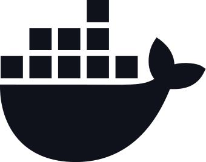

  

<h1 align="center">Gaurav Abhiman Mahajan</h1>

  <strong>Software engineer</strong> 
  Backend systems · architecture · data

<em>Software that remains understandable.</em>

  <a href="https://www.linkedin.com/in/gaurav-abhiman-mahajan/">LinkedIn</a> ·
  <a href="https://leetcode.com/u/gauravmahajan1175/">LeetCode</a> ·
  <a href="https://monkeytype.com/profile/GAM1175">Monkeytype</a>

---

<h3 align="center">Principles</h3>

  <code>clarity &gt; cleverness</code> ·
  <code>architecture &gt; frameworks</code> ·
  <code>documentation &gt; tribal knowledge</code>

<a href="philosophy.md">Engineering notes →</a>

<h3 align="center">Working set</h3>

  &nbsp;&nbsp;&nbsp;&nbsp;
  &nbsp;&nbsp;&nbsp;&nbsp;
  &nbsp;&nbsp;&nbsp;&nbsp;
  <picture>
    <source media="(prefers-color-scheme: dark)" srcset="assets/icons/docker-white.svg">
    
  </picture>

<h3 align="center">For the fun of it</h3>

  

  a fast cube · a familiar keyboard · one game I'll always replay

---

  <a href="profile.md">Profile</a> ·
  <a href="philosophy.md">Philosophy</a>

