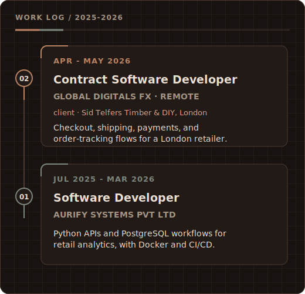
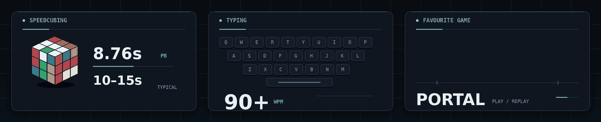

  
    
  <em>learning by building 
  and understanding how things work 
  is enough.</em>
    
  &nbsp;&nbsp;&nbsp;
  &nbsp;&nbsp;&nbsp;
  

 

---

<h3 align="center">Experience</h3>

  

---

<h3 align="center">Core stack</h3>

  &nbsp;&nbsp;&nbsp;&nbsp;
  &nbsp;&nbsp;&nbsp;&nbsp;
  &nbsp;&nbsp;&nbsp;&nbsp;
  <picture>
    <source media="(prefers-color-scheme: dark)" srcset="assets/icons/docker-white.svg">
    
  </picture>

---

<h3 align="center">Beyond the editor</h3>

  

  a fast cube · a familiar keyboard · one game I'll always replay

