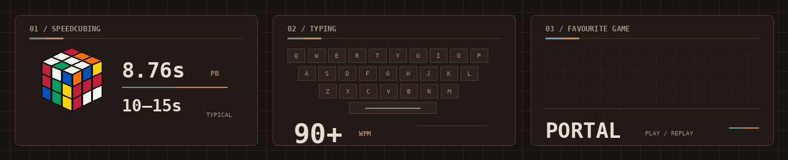

  

<h1 align="center">Gaurav Abhiman Mahajan</h1>

  <strong>Junior software developer</strong> 
  learning by building and understanding how things work

  <a href="https://www.linkedin.com/in/gaurav-abhiman-mahajan/">LinkedIn</a> ·
  <a href="https://leetcode.com/u/gauravmahajan1175/">LeetCode</a> ·
  <a href="https://monkeytype.com/profile/GAM1175">Monkeytype</a>

---

<h3 align="center">For the fun of it</h3>

  

  a fast cube · a familiar keyboard · one game I'll always replay

